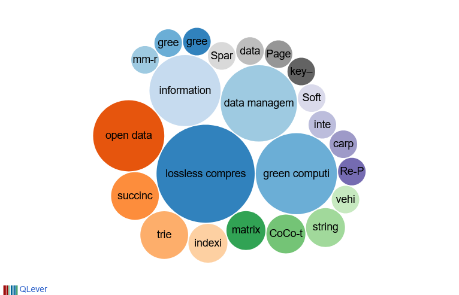
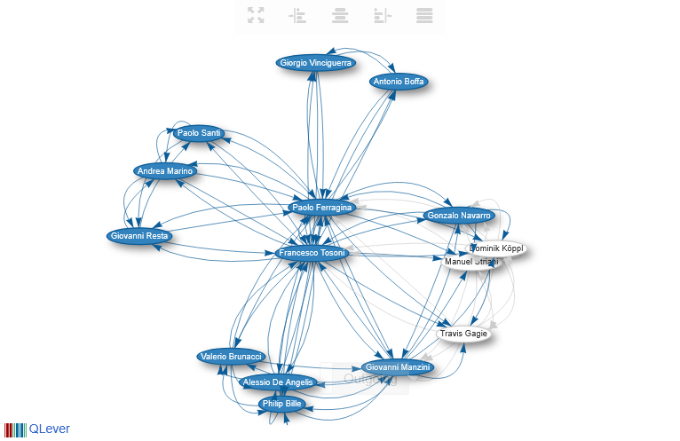
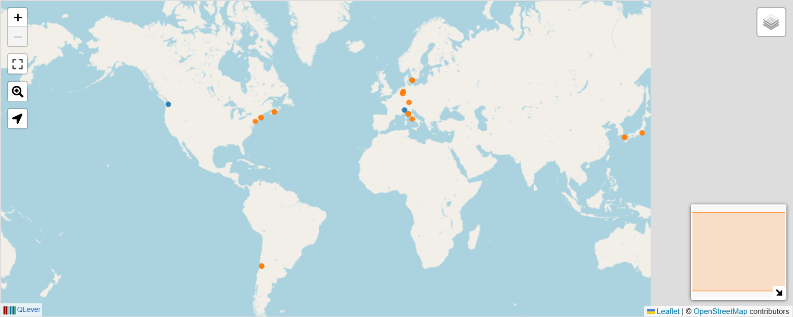

<h1 align="center">Hi, I'm Francesco Tosoni 👋</h1>

  <b>Computer Scientist (PhD)</b> · Lossless Compression · Compressed Data Structures · Green Algorithm Engineering

  
  
  

---

🔬 Researcher at **L'EMbeDS, Scuola Superiore Sant'Anna** (Pisa, Italy), working at the intersection of **lossless data compression**, **compressed data structures**, and **green, energy-aware algorithm engineering**.

My current work designs scalable, energy-aware compression, indexing, and semantic-search techniques for large source-code archives — in collaboration with **[Software Heritage](https://www.softwareheritage.org/)** — grounded in a commitment to open science and open-data infrastructures.

### 🧩 What I work on

- **Compression & compressed data structures** — lossless & computation-friendly compression, string indexing, stringology
- **Compressed linear algebra on GPUs** — grammar-compressed matrices, SpMV & PageRank kernels, memory-bounded engines
- **Code archives & semantic search** — source-code archives, code-to-code retrieval, digital preservation, open data
- **Green algorithm engineering** — energy–throughput trade-offs across the stack

### 📊 Research topics, collaborators & geography

<em>Live, interactive views generated from my <a href="https://www.wikidata.org/wiki/Q135913272">Wikidata</a> record via <a href="https://scholia.toolforge.org/">Scholia</a> — click any image to explore it interactively.</em>

<table>
  <tr>
    <td align="center" width="33%">
      <a href="https://wikidata-query-gui.scholia.wiki/embed.html#%23%20tool%3A%20scholia%0A%20%20%20%20%20%20%20%20%23defaultView%3ABubbleChart%0APREFIX%20target%3A%20%3Chttp%3A%2F%2Fwww.wikidata.org%2Fentity%2FQ135913272%3E%0APREFIX%20bd%3A%20%3Chttp%3A%2F%2Fwww.bigdata.com%2Frdf%23%3E%0APREFIX%20wdt%3A%20%3Chttp%3A%2F%2Fwww.wikidata.org%2Fprop%2Fdirect%2F%3E%0APREFIX%20wikibase%3A%20%3Chttp%3A%2F%2Fwikiba.se%2Fontology%23%3E%0APREFIX%20rdfs%3A%20%3Chttp%3A%2F%2Fwww.w3.org%2F2000%2F01%2Frdf-schema%23%3E%0ASELECT%20%3Fscore%20%3Ftopic%20%28COALESCE%28%3FtopicLabel_%2C%20REPLACE%28STR%28%3Ftopic%29%2C%20%22.%2a%2F%22%2C%20%22%22%29%29%20AS%20%3FtopicLabel%29%20WHERE%20%7B%0A%20%20%7B%0A%20%20%20%20SELECT%20%28SUM%28%3Fscore_%29%20AS%20%3Fscore%29%20%3Ftopic%20WHERE%20%7B%0A%20%20%20%20%20%20%7B%0A%20%20%20%20%20%20%20%20target%3A%20wdt%3AP101%20%3Ftopic%20.%0A%20%20%20%20%20%20%20%20BIND%20%2820%20AS%20%3Fscore_%29%0A%20%20%20%20%20%20%7D%0A%20%20%20%20%20%20UNION%20%7B%0A%20%20%20%20%20%20%20%20SELECT%20%283%20AS%20%3Fscore_%29%20%3Ftopic%20WHERE%20%7B%0A%20%20%20%20%20%20%20%20%20%20%3Fwork%20wdt%3AP50%20target%3A%20%3B%0A%20%20%20%20%20%20%20%20%20%20%20%20%20%20%20%20wdt%3AP921%20%3Ftopic%20.%0A%20%20%20%20%20%20%20%20%7D%0A%20%20%20%20%20%20%7D%0A%20%20%20%20%20%20UNION%20%7B%0A%20%20%20%20%20%20%20%20SELECT%20%281%20AS%20%3Fscore_%29%20%3Ftopic%20WHERE%20%7B%0A%20%20%20%20%20%20%20%20%20%20%3Fwork%20wdt%3AP50%20target%3A%20.%0A%20%20%20%20%20%20%20%20%20%20%3Fciting_work%20wdt%3AP2860%20%3Fwork%20.%0A%20%20%20%20%20%20%20%20%20%20%3Fciting_work%20wdt%3AP921%20%3Ftopic%20.%0A%20%20%20%20%20%20%20%20%7D%0A%20%20%20%20%20%20%7D%0A%20%20%20%20%7D%0A%20%20%20%20GROUP%20BY%20%3Ftopic%0A%20%20%7D%0A%20%20OPTIONAL%20%7B%0A%20%20%20%20%3Ftopic%20rdfs%3Alabel%20%3FtopicLabel_%20FILTER%20%28LANG%28%3FtopicLabel_%29%20%3D%20%22en%22%29%0A%20%20%7D%0A%7D%0AORDER%20BY%20DESC%28%3Fscore%29%0ALIMIT%20200"></a> 
      <b>Research topics</b>
    </td>
    <td align="center" width="33%">
      <a href="https://wikidata-query-gui.scholia.wiki/embed.html#%23%20tool%3A%20scholia%0A%20%20%20%20%20%20%20%20%23defaultView%3AGraph%0APREFIX%20target%3A%20%3Chttp%3A%2F%2Fwww.wikidata.org%2Fentity%2FQ135913272%3E%0A%23%20Egocentric%20co-author%20graph%20for%20an%20author%0APREFIX%20wd%3A%20%3Chttp%3A%2F%2Fwww.wikidata.org%2Fentity%2F%3E%0APREFIX%20wdt%3A%20%3Chttp%3A%2F%2Fwww.wikidata.org%2Fprop%2Fdirect%2F%3E%0ASELECT%20%3Fauthor1%20%3Fauthor1Label%20%3Frgb%20%3Fauthor2%20%3Fauthor2Label%20WHERE%20{%0A%20%20{%0A%20%20%20%20SELECT%20%3Fauthor1%20%3Fauthor2%20%3Frgb%20WHERE%20{%0A%20%20%20%20%20%20{%0A%20%20%20%20%20%20%20%20SELECT%20(COUNT(%3Fwork)%20AS%20%3Fcount)%20%3Fauthor1%20%3Fauthor2%20WHERE%20{%0A%20%20%20%20%20%20%20%20%20%20%23%20Find%20co-authors%0A%20%20%20%20%20%20%20%20%20%20%3Fwork%20wdt%3AP50%20target%3A%2C%20%3Fauthor1%2C%20%3Fauthor2%20.%0A%20%20%20%20%20%20%20%20%20%20%23%20Filtering%20%0A%20%20%20%20%20%20%20%20%20%20%23%20Only%20journal%20and%20conference%20articles%2C%20books%2C%20not%20(yet%3F)%20software%0A%20%20%20%20%20%20%20%20%20%20%23%20VALUES%20%3Fpublication_type%20{%20wd%3AQ13442814%20wd%3AQ571%20wd%3AQ26973022}%20%20%0A%20%20%20%20%20%20%20%20%20%20%23%20%3Fwork%20wdt%3AP31%20%3Fpublication_type%20.%0A%20%20%20%20%20%20%20%20}%0A%20%20%20%20%20%20%20%20GROUP%20BY%20%3Fauthor1%20%3Fauthor2%0A%20%20%20%20%20%20%20%20ORDER%20BY%20DESC(%3Fcount)%0A%20%20%20%20%20%20%20%20%23%20Limit%20the%20size%20of%20the%20graph%2C%20to%20avoid%20overburdening%20the%20browser%0A%20%20%20%20%20%20%20%20LIMIT%201000%0A%20%20%20%20%20%20}%0A%20%20%20%20%20%20%23%20Exclude%20self-links%0A%20%20%20%20%20%20FILTER%20(%3Fauthor1%20!%3D%20%3Fauthor2)%0A%20%20%20%20%20%20%23%20Color%20according%20to%20gender%0A%20%20%20%20%20%20OPTIONAL%20{%0A%20%20%20%20%20%20%20%20%3Fauthor1%20wdt%3AP21%20%3Fgender1%20.%0A%20%20%20%20%20%20%20%20BIND%20(IF(%3Fgender1%20%3D%20wd%3AQ6581097%2C%223182BD%22%2C%22E6550D%22)%20AS%20%3Frgb)%0A%20%20%20%20%20%20}%0A%20%20%20%20}%0A%20%20}%0A%23%20Label%20the%20results%20%0A%20%20OPTIONAL%20{%20%3Fauthor1%20%3Chttp%3A%2F%2Fwww.w3.org%2F2000%2F01%2Frdf-schema%23label%3E%20%3Fauthor1Label.%20FILTER(LANG(%3Fauthor1Label)%20%3D%20%22it-IT%22)%20}%0A%20%20%20%20OPTIONAL%20{%20%3Fauthor1%20%3Chttp%3A%2F%2Fwww.w3.org%2F2000%2F01%2Frdf-schema%23label%3E%20%3Fauthor1Label.%20FILTER(LANG(%3Fauthor1Label)%20%3D%20%22it%22)%20}%0A%20%20%20%20OPTIONAL%20{%20%3Fauthor1%20%3Chttp%3A%2F%2Fwww.w3.org%2F2000%2F01%2Frdf-schema%23label%3E%20%3Fauthor1Label.%20FILTER(LANG(%3Fauthor1Label)%20%3D%20%22en-US%22)%20}%0A%20%20%20%20OPTIONAL%20{%20%3Fauthor1%20%3Chttp%3A%2F%2Fwww.w3.org%2F2000%2F01%2Frdf-schema%23label%3E%20%3Fauthor1Label.%20FILTER(LANG(%3Fauthor1Label)%20%3D%20%22en%22)%20}%0A%20%20%20%20OPTIONAL%20{%20%3Fauthor1%20%3Chttp%3A%2F%2Fwww.w3.org%2F2000%2F01%2Frdf-schema%23label%3E%20%3Fauthor1Label.%20FILTER(LANG(%3Fauthor1Label)%20%3D%20%22mul%22)%20}%0A%20%20%20%20%0A%20%20%20%20OPTIONAL%20{%20%3Fauthor2%20%3Chttp%3A%2F%2Fwww.w3.org%2F2000%2F01%2Frdf-schema%23label%3E%20%3Fauthor2Label.%20FILTER(LANG(%3Fauthor2Label)%20%3D%20%22it-IT%22)%20}%0A%20%20%20%20OPTIONAL%20{%20%3Fauthor2%20%3Chttp%3A%2F%2Fwww.w3.org%2F2000%2F01%2Frdf-schema%23label%3E%20%3Fauthor2Label.%20FILTER(LANG(%3Fauthor2Label)%20%3D%20%22it%22)%20}%0A%20%20%20%20OPTIONAL%20{%20%3Fauthor2%20%3Chttp%3A%2F%2Fwww.w3.org%2F2000%2F01%2Frdf-schema%23label%3E%20%3Fauthor2Label.%20FILTER(LANG(%3Fauthor2Label)%20%3D%20%22en-US%22)%20}%0A%20%20%20%20OPTIONAL%20{%20%3Fauthor2%20%3Chttp%3A%2F%2Fwww.w3.org%2F2000%2F01%2Frdf-schema%23label%3E%20%3Fauthor2Label.%20FILTER(LANG(%3Fauthor2Label)%20%3D%20%22en%22)%20}%0A%20%20%20%20OPTIONAL%20{%20%3Fauthor2%20%3Chttp%3A%2F%2Fwww.w3.org%2F2000%2F01%2Frdf-schema%23label%3E%20%3Fauthor2Label.%20FILTER(LANG(%3Fauthor2Label)%20%3D%20%22mul%22)%20}%0A%20%20%20%20%0A}"></a> 
      <b>Co-author network</b>
    </td>
    <td align="center" width="33%">
      <a href="https://wikidata-query-gui.scholia.wiki/embed.html#%23%20tool%3A%20scholia%0A%20%20%20%20%20%20%20%20PREFIX%20target%3A%20%3Chttp%3A%2F%2Fwww.wikidata.org%2Fentity%2FQ135913272%3E%0A%23defaultView%3AMap%0APREFIX%20wdt%3A%20%3Chttp%3A%2F%2Fwww.wikidata.org%2Fprop%2Fdirect%2F%3E%0ASELECT%20%3Forganization%20%3ForganizationLabel%20%3Fgeo%20%3Fcount%20%3Flayer%20WHERE%20{%0A%20%20{%0A%20%20%20%20SELECT%20DISTINCT%20%3Forganization%20%3Fgeo%20(COUNT(DISTINCT%20%3Fwork)%20AS%20%3Fcount)%20WHERE%20{%0A%20%20%20%20%20%20%3Fwork%20wdt%3AP50%20target%3A%20%3B%0A%20%20%20%20%20%20%20%20%20%20%20%20wdt%3AP50%20%3Fauthor%20.%0A%20%20%20%20%20%20FILTER%20(%3Fauthor%20!%3D%20target%3A)%0A%20%20%20%20%20%20%3Fauthor%20(wdt%3AP108%20|%20wdt%3AP463%20|%20wdt%3AP1416)%2Fwdt%3AP361*%20%3Forganization%20.%0A%20%20%20%20%20%20%3Forganization%20(wdt%3AP625%20|%20((wdt%3AP276%20|%20wdt%3AP159)%2Fwdt%3AP625))%20%3Fgeo%20.%0A%20%20%20%20}%0A%20%20%20%20GROUP%20BY%20%3Forganization%20%3Fgeo%20%3Fcount%0A%20%20%20%20ORDER%20BY%20DESC(%3Fcount)%0A%20%20%20%20LIMIT%202000%0A%20%20}%0A%20%20BIND%20(IF((%3Fcount%20%3C%201)%2C%22No%20results%22%2CIF((%3Fcount%20%3C%202)%2C%221%20result%22%2CIF((%3Fcount%20%3C%2011)%2C%221%20%3C%20results%20%E2%89%A4%2010%22%2CIF((%3Fcount%20%3C%20101)%2C%2210%20%3C%20results%20%E2%89%A4%20100%22%2CIF((%3Fcount%20%3C%201001)%2C%22100%20%3C%20results%20%E2%89%A4%201000%22%2CIF((%3Fcount%20%3C%2010001)%2C%221000%20%3C%20results%20%E2%89%A4%2010000%22%2C%22over%2010000%20results%22))))))%20AS%20%3Flayer)%0A%20%20OPTIONAL%20{%20%3Forganization%20%3Chttp%3A%2F%2Fwww.w3.org%2F2000%2F01%2Frdf-schema%23label%3E%20%3ForganizationLabel.%20FILTER(LANG(%3ForganizationLabel)%20%3D%20%22it-IT%22)%20}%0A%20%20%20%20OPTIONAL%20{%20%3Forganization%20%3Chttp%3A%2F%2Fwww.w3.org%2F2000%2F01%2Frdf-schema%23label%3E%20%3ForganizationLabel.%20FILTER(LANG(%3ForganizationLabel)%20%3D%20%22it%22)%20}%0A%20%20%20%20OPTIONAL%20{%20%3Forganization%20%3Chttp%3A%2F%2Fwww.w3.org%2F2000%2F01%2Frdf-schema%23label%3E%20%3ForganizationLabel.%20FILTER(LANG(%3ForganizationLabel)%20%3D%20%22en-US%22)%20}%0A%20%20%20%20OPTIONAL%20{%20%3Forganization%20%3Chttp%3A%2F%2Fwww.w3.org%2F2000%2F01%2Frdf-schema%23label%3E%20%3ForganizationLabel.%20FILTER(LANG(%3ForganizationLabel)%20%3D%20%22en%22)%20}%0A%20%20%20%20OPTIONAL%20{%20%3Forganization%20%3Chttp%3A%2F%2Fwww.w3.org%2F2000%2F01%2Frdf-schema%23label%3E%20%3ForganizationLabel.%20FILTER(LANG(%3ForganizationLabel)%20%3D%20%22mul%22)%20}%0A%20%20%20%20%0A}%0AORDER%20BY%20DESC(%3Fcount)"></a> 
      <b>Collaboration geography</b>
    </td>
  </tr>
</table>

### 🛠️ Tech stack

### 📌 Selected projects

- **[mediawiki-code2code-search](https://github.com/ftosoni/mediawiki-code2code-search)** — semantic code search over 1.1M+ MediaWiki snippets (Jina AI embeddings, cross-language retrieval, SWHID permalinks)
- **[green-compressed-storage](https://github.com/ftosoni/green-compressed-storage)** — GiB/s Permute-Partition-Compress source-code storage on RocksDB
- **[g-mm-repair](https://github.com/ftosoni/g-mm-repair)** — memory-bounded GPU engine for right-multiplication over grammar-compressed matrices
- **[green-lossless-spmv](https://github.com/acubeLab/green-lossless-spmv)** — space/time/energy-optimised lossless SpMV

### 🌍 Open data & community

Maintainer of open-source tools on **Wikimedia Toolforge**, active member of the **Indic MediaWiki Developers User Group**, and a [Diff author](https://diff.wikimedia.org/author/super-nabla/). 150+ Wikipedia articles started and structured data curated at scale on Wikidata.

### 🎓 Research profiles

### 📫 Reach me

📧 francesco.tosoni@santannapisa.it · 🌐 [francescotosoni.it](https://www.francescotosoni.it) · 🦋 [@ftosoni on GitLab](https://gitlab.com/ftosoni)

  
  

